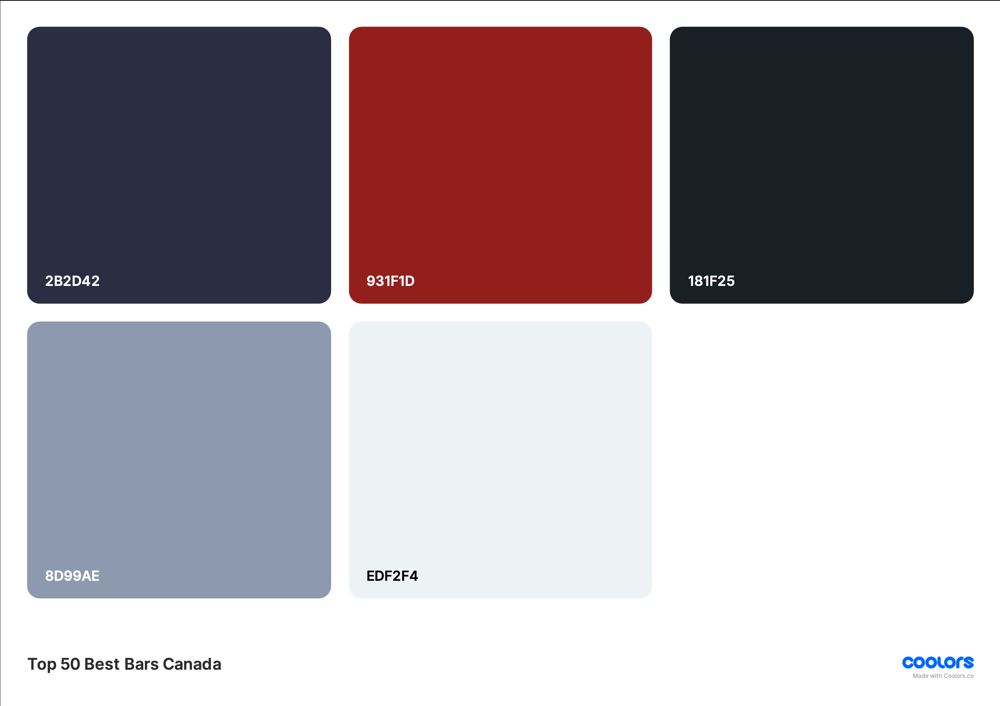

# Style Guide

## Table of Contents

- [Fonts](#fonts)
- [Color Palette](#color-palette)

## Fonts

``` CSS
/* Aktiv Grotesk Thin */
font-family: "aktiv-grotesk-thin", sans-serif;
font-weight: 200;
font-style: normal;
```

```CSS
/* Aktiv Grotesk Regular */
font-family: "aktiv-grotesk", sans-serif;
font-weight: 400;
font-style: normal;
```

``` CSS
/* Aktiv Grotesk Italic */
font-family: "aktiv-grotesk", sans-serif;
font-weight: 400;
font-style: italic;
```

``` CSS
/* Aktiv Grotesk SemiBold */
font-family: "aktiv-grotesk", sans-serif;
font-weight: 600;
font-style: normal;
```

``` CSS
/* Aktiv Grotesk Bold */
font-family: "aktiv-grotesk", sans-serif;
font-weight: 700;
font-style: normal;
```

## Color Palette

- Primary `#931f1d`

- Secondary `#2b2d42`

- Light Shade `#edf2f4`

- Medium Shade `#8d99ae`

- Dark Shade `#181f25`

``` JavaScript
/* Array */
["2b2d42","931f1d","181f25","8d99ae","edf2f4"]

/* Object */
{"Space cadet":"2b2d42","Carmine":"931f1d","Eerie black":"181f25","Cool gray":"8d99ae","Anti-flash white":"edf2f4"}
```


